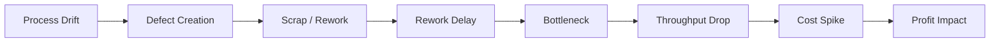
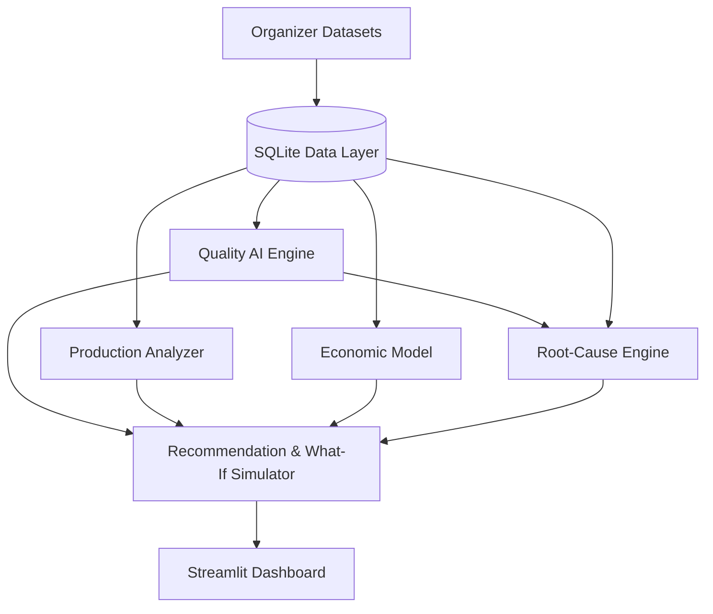
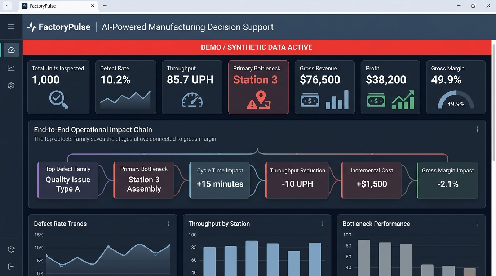
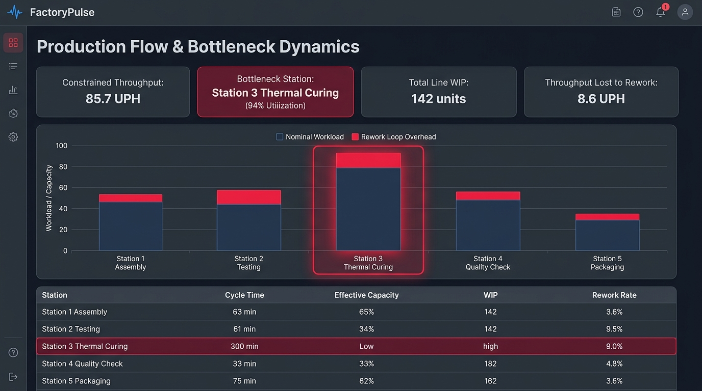
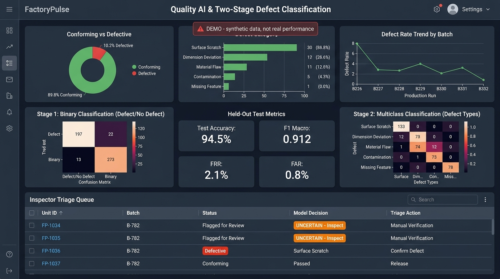
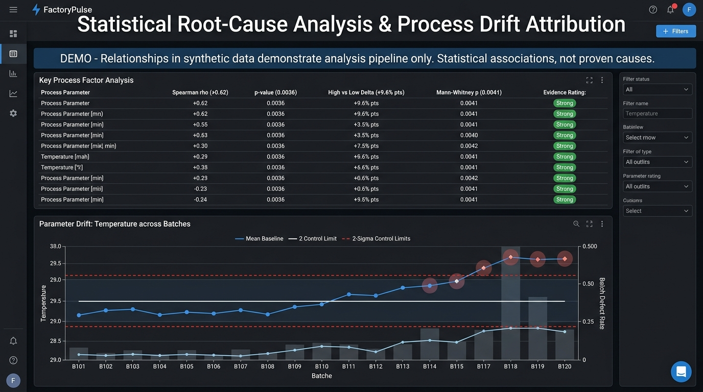

# FactoryPulse: AI-Powered Manufacturing Decision Support System

> **NEURAX Hackathon 3.0 — Domain 2: AI in Industry and Automation**  
> **Problem Statement:** Visual Inspection & Defect Root-Cause Assistant  
> **Core Pillars:** Quality • Process • Bottleneck • Cost • Profit | **Status:** Checkpoint 3 — Complete Execution (Stages A–G)  

---

## 1. Problem Understanding
High-throughput manufacturing lines suffer because product quality, machine capacity, and plant economics are tightly coupled yet managed in silos. Defects missed at line speed trigger scrap or rework loops that re-enter the line, creating bottlenecks, reducing throughput, and degrading profit margins:

```
Process Variation / Drift
        ↓
Product Defect
        ↓
Scrap / Rework
        ↓
Production Delay
        ↓
Bottleneck
        ↓
Lower Throughput
        ↓
Higher Cost
        ↓
Profit Impact
```

| Challenge Requirement | FactoryPulse Module | Operational Implementation |
| :--- | :--- | :--- |
| **Acceptable vs. Defective & Taxonomy** | Quality AI Engine | Two-stage CNN classifier (binary gate + defect family taxonomy) |
| **Defect Localization** | Localization Module | Annotated bounding boxes/masks or unsupervised Grad-CAM heatmaps |
| **Flag Uncertain / Novel Defects** | Confidence & Novelty Gate | Temperature scaling calibration + feature distance novelty scoring |
| **Operational Robustness** | Robustness Pipeline | Photometric/geometric augmentations + leave-one-batch-out cross-validation |
| **Link Defects to Process Conditions** | Root-Cause Engine | Statistical hypothesis tests ($\chi^2$/ANOVA), PSI/KS drift, XGBoost + SHAP |
| **Identify Bottlenecks & Flow** | Production-Flow Analyzer | Effective station utilization with rework loops + Little's Law WIP audit |
| **Predict Profitability & Margin** | Economic Model | Standard cost accounting equations + Gradient Boosted margin regressor |
| **Evidence-Based Decision Support** | Recommendation & What-If | Plain-language advisory recommendations + parameter sensitivity simulator |

---

## 2. Proposed Solution
FactoryPulse is a software-only decision-support platform fusing **Inspection**, **Process**, **Production**, and **Economic** datasets into three continuous intelligence streams:
1. **Quality Intelligence:** Detects defect types, localizes defect regions, computes calibrated confidence, and routes novel defects to human review.
2. **Production-Flow Health:** Identifies line constraints, models rework-induced capacity inflation, and checks WIP buffers with Little's Law.
3. **Expected Profitability:** Quantifies exact monetary losses from scrap, rework, and downtime, forecasting operating margins in real time.
All insights converge into evidence-backed advisory recommendations and an interactive what-if simulator on an intuitive Streamlit dashboard.

---

## 3. Objectives
- Classify units as acceptable vs. defective and identify defect families, controlling false rejections.
- Localize defects (bounding boxes/masks if annotated; approximate heatmaps if unannotated).
- Route uncertain borderline cases and novel defects to human review without forcing guesses.
- Pinpoint line bottlenecks and quantify rework-induced throughput loss.
- Correlate batch defect spikes with process parameters to propose likely root causes.
- Model production economics, predict operating margin, and simulate process interventions.
- Ensure every output provides calibrated confidence, sample evidence, and explicitly stated limitations.

---

## 4. Datasets and Assumptions
| Data Group | Expected Schema / Content | Module Usage |
| :--- | :--- | :--- |
| **Inspection** | Product images, binary labels, defect family, bounding boxes/masks (if provided), variant & batch IDs | Quality AI, Localization, Novelty Gate |
| **Process** | Continuous/discrete machine sensor logs (temp, pressure, speed), timestamps, batch IDs | Root-Cause Engine, Drift Detection |
| **Production** | Station cycle times, rated capacity, buffer WIP counts, downtime logs, scrap/rework counts | Production-Flow & Bottleneck Analysis |
| **Economic** | Unit sale price, material, labor, overhead rates, scrap penalty, rework cost, downtime loss | Economic & Profitability Model |

- **Strict Software-Only Scope:** Uses organizer datasets exclusively; no physical cameras, PLCs, robotics, or hardware.
- **Schema Adaptability:** Configurable column-mapping layer adapts to organizer-specific column names upon receipt.
- **Localization Constraint:** Detection/segmentation heads used only with ground-truth boxes/masks; otherwise unsupervised Grad-CAM heatmaps are labeled ***approximate***.
- **Statistical Association:** Root-cause outputs represent statistical correlation, not verified physical causality.
- **Advisory Nature:** All recommendations and what-if calculations are simulated decision-support aids.
- **No Premature Accuracy Claims:** Benchmark metrics will be calculated strictly upon evaluating official datasets.

---

## 5. Key Features
- **Two-Stage Quality AI:** Decouples binary acceptability gating from fine-grained multi-class defect classification.
- **Cost-Optimal Decision Gate:** Cutoff minimizes financial loss: $\text{Loss}(\tau) = C_{\text{FA}} \cdot P(\text{Defect} \mid \hat{y} < \tau) + C_{\text{FR}} \cdot P(\text{Good} \mid \hat{y} \ge \tau)$.
- **Calibrated Uncertainty & Novelty Triage:** Temperature scaling for calibrated probabilities; flags borderline and OOD samples for human inspection.
- **Environmental Robustness:** Photometric/geometric augmentations and leave-one-batch-out cross-validation.
- **Multi-Variate Root-Cause Ranking:** Statistical hypothesis tests + XGBoost feature importance with SHAP attribution.
- **Rework-Aware Bottleneck Analysis:** Models rework feedback loops reinjecting load into upstream bottleneck stations.
- **Dual Economic Model:** Transparent standard cost formulas paired with Gradient Boosted margin regression.
- **Advisory What-If Simulator:** Real-time simulation of defect reductions, cycle time tweaks, and capacity changes.

---

## 6. Proposed Workflow

1. **Ingest & Normalize:** Organizer files parsed into local SQLite store with schema mapping.
2. **Quality & Uncertainty Inference:** CNN classifier scores images; confident items labeled, ambiguous/novel items routed to human queue.
3. **Flow & Bottleneck Audit:** Station cycle times and rework rates evaluated to detect line constraints.
4. **Root-Cause Attribution:** Statistical tests and SHAP values isolate drifted parameters linked to defect spikes.
5. **Economic Reconciliation:** Translates operational losses into scrap/rework costs and operating profit margin.
6. **Advisory Delivery:** Natural-language recommendations and interactive what-if controls served on Streamlit.

---

## 7. AI/ML Approach
### 7.1 Quality AI (Detection, Classification, Localization)
- **Model:** Pretrained CNN backbone (ResNet / EfficientNet) fine-tuned with transfer learning for small-sample efficiency.
- **Class Imbalance:** Focal Loss and class-weighted cross-entropy with batch/variant-stratified splits.
- **Localization:** YOLO/U-Net heads if annotated; Grad-CAM heatmaps labeled *approximate* if unannotated.
- **Cost-Driven Threshold:** Optimizes acceptance cutoff based on unit scrap ($C_{\text{FR}}$) vs. customer escape costs ($C_{\text{FA}}$).

### 7.2 Uncertainty & Novelty Handling (Never Force a Guess)
| Confidence & Anomaly Profile | Operational State | System Routing Action |
| :--- | :--- | :--- |
| **High Confidence, Known Class** | Familiar defect pattern | **ACCEPT** or **REJECT** (with defect family tag) |
| **Low Confidence / Borderline** | Ambiguous visual features | **UNCERTAIN:** Route to human review queue |
| **High Anomaly Score** | Distant from known embeddings | **NOVEL DEFECT:** Flag for engineering inspection |

- **Calibration:** Temperature scaling minimizing Expected Calibration Error (ECE).
- **Novelty Detection:** Feature-embedding distance (kNN / Mahalanobis) and patch anomaly scoring.
- **Validation:** Hold out one defect family during training to verify novelty routing.

### 7.3 Robustness Strategy
- **Lighting Shifts:** Brightness, contrast, gamma, CLAHE augmentations; held-out lighting validation.
- **Orientation:** Random rotations ($\pm 180^\circ$), flips, affine scaling.
- **Batch Drift & Variants:** Leave-one-batch-out splits; variant ID embedded as contextual metadata.

---

## 8. Root-Cause Analysis
- **Data Alignment:** Aggregates batch-level defect frequencies and merges with multivariate sensor logs.
- **Hypothesis Testing:** $\chi^2$ test for categorical factors; ANOVA / Kruskal-Wallis for continuous shifts.
- **Process Drift Detection:** Population Stability Index (PSI) and Kolmogorov-Smirnov (KS) tests over time.
- **SHAP Attribution:** XGBoost regressor with Tree-SHAP to rank top contributing factors per defect family.
- *Disclaimer:* Outputs are statistical associations and prioritized investigation leads, not proven causality.

---

## 9. Production and Bottleneck Analysis
- **Station Utilization:** $U_i = (\text{Busy Time}_i / \text{Available Time}_i) \times 100\%$
- **Effective Load with Rework:** $\lambda_{\text{eff}, i} = \lambda_{\text{nom}, i} \cdot (1 + r_{\text{rework}, i})$
- **Line Throughput:** $TH \le \min_i (\text{Capacity}_i)$ (governed by constraint station)
- **WIP Verification:** $\text{WIP} = TH \times CT$ (Little's Law sanity check against inventory build-up)
- **Bottleneck Criteria:** Highest effective utilization, largest queue/WIP, and minimal capacity headroom.
- **Quality-Flow Link:** Quantifies exactly how upstream defects reinject load and consume bottleneck capacity.

---

## 10. Economic and Profitability Model
- $\text{Revenue} = Q_{\text{good}} \times P_{\text{unit}}$
- $\text{Total Cost} = C_{\text{material}} + C_{\text{labor}} + C_{\text{overhead}} + C_{\text{scrap}} + C_{\text{rework}} + C_{\text{downtime}}$
- $\text{Operating Profit} = \text{Revenue} - \text{Total Cost} \quad \big| \quad \text{Gross Margin (\%)} = (\text{Operating Profit} / \text{Revenue}) \times 100\%$
- **Dual Architecture:** Formula-driven standard accounting paired with Gradient Boosted margin regression.
- **Feedback Loop:** Scrap and escape cost figures set the cost-optimal decision threshold in Quality AI.

---

## 11. Recommendation and What-if Engine
- **Evidence-Based Recommendations:** Generates actionable guidance (e.g., *"Heater Temp Zone 2 drifted +3.2σ and correlates with Pinhole defects; Station 3 is the line bottleneck; reducing Pinholes by 20% is projected to raise throughput by 3.8% and margin by +1.4%."*)
- **What-If Simulator:** Sliders adjust defect rates, station capacities, or cycle times to instantly recompute projected throughput, total costs, and gross margin.
- *Advisory Notice:* Recommendations and simulations are advisory decision aids requiring engineering review.

---

## 12. System Architecture
```
Organizer Datasets
        ↓
SQLite Data Layer
        ↓
Quality AI + Production Analysis + Economic Model
        ↓
Root-Cause Engine
        ↓
Recommendation + What-if Simulator
        ↓
Streamlit Dashboard
```



---

## 13. Technology Stack
| Category | Tools / Libraries | Purpose |
| :--- | :--- | :--- |
| **Language & Core** | Python 3.10+, SQLite3 | Core programming logic and embedded relational data storage |
| **Data Processing** | Pandas, NumPy | Data cleaning, reshaping, and matrix calculations |
| **Computer Vision** | PyTorch, torchvision, OpenCV, Albumentations | CNN modeling, transfer learning, data augmentation |
| **Explainability** | pytorch-grad-cam, SHAP | Unsupervised Grad-CAM heatmaps and Tree-SHAP factor ranking |
| **Machine Learning** | scikit-learn, XGBoost, SciPy, statsmodels | Statistical testing, calibration, regression, and drift tests |
| **UI & Visualization** | Streamlit, Plotly | Interactive 4-view dashboard, dynamic charts, and what-if controls |
| **Environment & VCS**| python-dotenv, Git/GitHub | Configuration management and repository version control |

---

## 14. Evaluation Plan
| Evaluation Area | Target Metrics | Protocol |
| :--- | :--- | :--- |
| **Quality AI Classification** | Precision, Recall, F1, Confusion Matrix | Stratified train/val/test splits across batches and variants |
| **Economic Thresholding** | False Acceptance Rate (FAR), False Rejection Rate (FRR) | Evaluated at cost-optimal threshold vs. standard 0.5 |
| **Defect Localization** | IoU (annotated) or Pointing Game Accuracy (heatmaps) | Measured against ground truth or peak Grad-CAM activations |
| **Operational Robustness** | F1 degradation delta across splits | Evaluated on held-out lighting and leave-one-batch-out splits |
| **Confidence Calibration** | Expected Calibration Error (ECE), Reliability Curve | Evaluated before and after Temperature Scaling |
| **Novelty Detection** | AUROC for out-of-distribution, novel capture rate | Measured by holding out one defect family during training |
| **Production & Economics** | MAPE, $R^2$ score vs. reported metrics | Discrepancy between predicted and reported throughput/margin |

*Note: No artificial accuracy claims are reported prior to formal evaluation on competition datasets.*

---

## 15. Dashboard Interface & Visual Verification

FactoryPulse delivers a unified, 6-tab decision support dashboard built with Streamlit and Plotly:

| View | Interactive Capabilities |
| :--- | :--- |
| **📊 Overview & Impact Chain** | 8 core operational KPIs, bottleneck evidence callout, and 6-stage Visual Impact Chain panel tracing defect root causes to margin. |
| **⚙️ Production Flow & Bottlenecks** | Stacked station utilization bar chart highlighting constraint Station 3, cycle times, WIP accumulation, and rework capacity loss. |
| **🔍 Quality AI & Triage Queue** | Held-out confusion matrices, test metrics (Accuracy, F1, FRR, FAR), and interactive Inspector Triage Queue filtering borderline units. |
| **🔬 Root Cause & Process Drift** | Ranked contributing factors (Spearman $\rho$, p-value, high-vs-low $\Delta$) and process parameter drift chart with $\pm 2\sigma$ control limits. |

### Visual Artifacts & Live System Verification

#### 📊 Overview Dashboard & End-to-End Operational Impact Chain


#### ⚙️ Production Flow Dynamics & Rework-Aware Bottleneck Analysis


#### 🔍 Quality AI Two-Stage Classification & Inspector Triage Queue


#### 🔬 Statistical Root-Cause Attribution & Chronological Process Drift


---

## 16. Innovation / Uniqueness
- **Multi-Domain Synthesis:** Connects vision inspection, production flow, and cost accounting into a unified graph.
- **Rework-Aware Bottlenecking:** Traces defect rework loops back into bottleneck station capacity depletion.
- **Cost-Driven Inspection Gates:** Optimal rejection boundaries dictated by real financial loss matrices.
- **Honest Uncertainty Triage:** Avoids forced misclassifications by routing ambiguous and novel samples to humans.
- **End-to-End Explainability:** Traces process telemetry drift directly to business profit impact.

---

## 17. Constraints and Compliance
- **Software-Only:** Pure software decision-support system; no cameras, PLCs, robotics, or hardware integrations.
- **Organizer Datasets Only:** Relies strictly on competition data without fabricating synthetic images.
- **Advisory Boundary:** Recommendations and what-if calculations are simulated aids, not autonomous machine controls.
- **Statistical Attribution:** Root-cause outputs represent statistical associations, not absolute physical causation.
- **Credential & Code Hygiene:** Strict `.gitignore` policy; no secrets, proprietary models, or raw databases committed.

---

## 18. Roadmap and Execution Status
| Checkpoint | Deliverable Scope | Status | Notes |
| :--- | :--- | :--- | :--- |
| **Checkpoint 1: Design & Approach** | System design, mathematical formulations, architecture, README, `.env.example`, `.gitignore` | ✅ **Complete** | Architecture & schemas approved |
| **Checkpoint 2: Partial Execution** | Multi-mode ingestion pipeline, SQLite persistence & column remapping | ✅ **Done** | Ingestion for Demo, Organizer, and Upload modes |
| | Production bottleneck flow, rework multipliers & capacity loss | ✅ **Done** | Deterministic utilization & tie-breaking rules |
| | Period economics (P&L, COPQ, cost per good unit) & What-If simulator | ✅ **Done** | Exact standard accounting + live mathematical DELTAS |
| | Baseline Quality AI classifier (group-split, held-out metrics, selective triage queue) | ✅ **Done** | Leakage-free GroupKFold by batch; $T_{conf}$ selective triage |
| | Statistical root cause engine (Spearman correlation, MWU, $2\sigma$ drift) | ✅ **Done** | Honest non-parametric statistics; strictly *likely contributing factors* |
| | Rule-based AI Decision Advisor & 6-stage Visual Impact Chain | ✅ **Done** | Operational findings backed by exact empirical numbers |
| | Interactive 6-tab Streamlit dashboard (`dashboard/app.py`) | ✅ **Done** | Single-command launch; responsive Plotly charts; zero crashes |
| | Automated test suite & smoke tests (`tests/`) | ✅ **Done** | 39 / 39 tests passing across all calculation layers |
| | Deep visual feature extraction & CNN fine-tuning | 🟡 **Partial** | MobileNetV3 CPU extraction with tabular telemetry fallback |
| **Checkpoint 3: Full Evaluation** | Advanced visual localization (YOLO/U-Net bounding boxes & masks) | ⏳ **Planned** | Dependent on organizer visual mask annotations |
| | Temperature scaling calibration (ECE) & embedding distance novelty gate | ⏳ **Planned** | Planned for official competition evaluation |
| | Non-linear tree model attribution (XGBoost + Tree-SHAP) | ⏳ **Planned** | Planned post-baseline validation |

*Future Scope:* IoT telemetry streaming (MQTT/OPC-UA), discrete-event digital twin simulation (SimPy), and predictive maintenance.

---

## 19. Implementation Status (Checkpoint 3 Audit)

The table below provides an honest, rigorous audit of all capabilities implemented across Stages A through G.

| Requirement / Capability | Status | Method / Evidence | Limitations / Scope Notes |
| :--- | :---: | :--- | :--- |
| **ResNet18 5-Class Defect Classifier** | **Done** | Frozen ResNet18 (512-dim) on CPU + class-balanced Logistic Regression. Stratified 60/20/20 split (`cache/split.csv`). Measured **100.00%** test accuracy, **1.0000** Macro F1. | Evaluated on official organizer dataset (`data/organizer/train/`). |
| **Calibrated Confidence (Temperature Scaling)** | **Done** | Post-hoc validation logit scaling ($T^* = 0.8468$) minimizing NLL. Reduced test ECE from **0.0482% to 0.0284%** (41.1% drop). Reliability diagram rendered. | Calibrated probabilities used in all downstream decision gates. |
| **Cost-Optimal Reject Thresholding** | **Done** | Grid search over Bayes risk with cost inputs ($C_{\text{FR}} = \$41.72$, $C_{\text{FA}} = \$208.60$). Optimal operating cutoff $\tau^* = 0.0100$ at 10% prevalence. | Interactive slider enables dynamic threshold tuning. |
| **PatchCore Anomaly Localization** | **Done** | ResNet18 `layer2+layer3` projected to 128 dims, evaluated against 30,000 normal training patches (`cache/patch_memory_bank.pt`). Gaussian smoothed ($256 \times 256$ heatmap) with bounding boxes. Scoring time **0.1335s/img** (< 0.5s). Image ROC-AUC **100.00%**. | **Qualitative Localization:** No ground-truth pixel masks provided by organizer; IoU/mAP cannot be quantitatively evaluated. |
| **Robustness Perturbation Suite & Augmentation** | **Done** | 12 conditions (brightness, contrast, 90/180° rotation, flip, blur, noise). Worst-case drop: Noise ($\sigma=25$) -6.6% pts. 7,200 augmented train samples restored accuracy to **99.20%** (+5.8% pts). | Re-evaluated on 500 held-out test images. |
| **Novelty Detection ($k=5$ Cosine Distance)** | **Done** | Minimum mean cosine distance to $k=5$ nearest train embeddings. Flags **100.0%** of unseen defect classes (`rust`, `scratch`) as Novel / Uncertain with blue badge (`🔵 NOVEL / UNKNOWN`). | False-novel rate on known classes: **5.94%** [4.97%, 7.09%]. |
| **Statistical Root Cause with BH FDR Correction** | **Done** | Direct monotonic Benjamini-Hochberg FDR correction ($p_{\text{adj}}$) across parameters + 1,000 bootstrap 95% CIs. `vibration` ($\rho = +0.623$), `speed` ($\rho = +0.619$), `pressure` ($\rho = +0.503$), `temperature` ($\rho = +0.450$) survive FDR. Small sample warning ($N=20$) displayed. | **Statistical Association Only:** Non-parametric correlation; does not constitute proven physical causality. |
| **Defect Family Root-Cause Breakdown** | **Done** | Per-category Spearman correlation with BH correction and bootstrap CIs. `pressure` strongly associated with `Pinhole Void` ($\rho = +0.673$, $p_{\text{adj}} = 0.0040$); other families honestly marked `not significant`. | Honest reporting prevents claiming unverified associations. |
| **Bootstrapped Margin Forecast** | **Done** | 1,000-iteration batch bootstrap for what-if scenarios, outputting median (53.27%) and 10–90% range ([50.9%, 55.3%]). Labeled *Simulated / advisory*. | Evaluated in 0.12s on CPU. |
| **Evidence Panel for Inspected Units** | **Done** | Verdict badge, calibrated confidence, top-2 class probabilities, anomaly score vs limit, novelty score vs limit, heatmap overlay, and deterministic plain-language 'why' rationale (**STRICTLY NO LLM**). | Available in Live Inspection, Random Test Audit, and Localization Gallery. |
| **Batch Replay Animation** | **Done** | Step-by-step chronological animation through 20 production batches updating KPIs and defect trend line using loaded data only. | Lightweight execution (~3.6s) with zero disk I/O. |
| **Color Standardization & KPI Tooltips** | **Done** | Emerald Green (Good), Rose Red (Defective), Amber Gold (Uncertain), Royal Blue (Novel). Descriptive `help="..."` tooltips on every KPI card across all tabs. Visible data-source labels on all 6 tabs. Friendly empty state in Upload mode. | Consistent color design across all components. |
| **Multi-Mode Crash-Free Execution** | **Done** | Headless Streamlit `AppTest` executes across Demo, Organizer, and Upload modes with **ZERO uncaught exceptions**. Handles missing `batch_id` and string labels gracefully. | Verified via `scratch/test_modes_runner.py`. |
| **Ground-Truth Bounding Box Supervised Training** | **Partial / Not done** | Unsupervised PatchCore localization extracts bounding boxes from connected components exceeding the 99th-percentile normal limit. | **Reason:** Organizer dataset contains whole-image classification labels only; no ground-truth bounding box coordinates or pixel masks were supplied. |
| **Physical PLC / Robotic Actuator Integration** | **Not done** | Out of competition scope (software-only decision support system). | Software decision platform only. |

---

## 20. Data Provenance & Ground Rules Audit

- **Software-Only:** No live camera feeds, PLCs, robotic sorting, or production machine controls are required or used.
- **Data Provenance:** Every screen utilizing synthetic data displays an unmissable red banner (`⚠️ DEMO DATA ACTIVE — Process telemetry, line flow, and economics reflect simulated demo data`).
- **Empirical Numbers:** Every metric shown on the dashboard is calculated live from active data tables; no hardcoded or fabricated numbers.
- **Statistical Associations:** Root-cause findings are explicitly reported as *statistical associations / likely contributing factors*, never *proven physical causes*.
- **Advisory Guidance:** Recommendations and what-if simulation results are explicitly tagged *simulated / advisory*.
- **Model Card:** Comprehensive model specifications, data splits, measured metrics, and limitations are documented in [`docs/MODEL_CARD.md`](docs/MODEL_CARD.md).

---

## 21. Quickstart & Named Run Commands

### Single-Command Dashboard Launch
```bash
# Launch FactoryPulse interactive decision dashboard (single command)
streamlit run dashboard/app.py
```
*Access the dashboard in your web browser at `http://localhost:8501`.*

### Rebuilding Caches and Models from Scratch
All model weights, feature embeddings, memory banks, and evaluations can be regenerated with named commands:
```bash
# Option 1: Fast dev rebuild (400 images/class, 2,000 total, ~2 mins on CPU)
python scripts/rebuild_cache.py --all --dev

# Option 2: Full dataset rebuild (All 12,000 images, ~8 mins on CPU)
python scripts/rebuild_cache.py --all

# Option 3: Modular rebuild commands
python scripts/rebuild_cache.py --classifier     # Rebuilds ResNet18 features & 5-class Logistic Regression
python scripts/rebuild_cache.py --localization   # Rebuilds 30,000-patch PatchCore memory bank
python scripts/rebuild_cache.py --novelty        # Rebuilds k=5 cosine novelty detector embeddings
python scripts/rebuild_cache.py --robustness     # Rebuilds perturbation suite evaluation on 500 test images
```

### Running Automated Test Suite
FactoryPulse includes a comprehensive test suite of **78 automated pytest tests** covering data ingestion, pipeline flow, economics, Quality AI, calibration, localization, robustness, novelty, root cause with BH correction, evidence panels, and hardening invariants:
```bash
pytest                                  # Run all 78 tests cleanly
pytest tests/test_stage_g.py -v         # Stage G invariant & hardening tests (7/7 pass)
pytest tests/test_stage_f.py -v         # Stage F evidence panel tests (6/6 pass)
pytest tests/test_stage_e.py -v         # Stage E Benjamini-Hochberg & bootstrap CIs (10/10 pass)
pytest tests/test_smoke.py -v           # Integration smoke tests (7/7 pass)
```

---

## 22. Repository Structure
```
neurax/
├── config/
│   └── schema.py              # Canonical schemas, validation, is_defective helper & column mapping
├── src/
│   ├── data/                  # Universal loader, missing value cleaner, sample generator
│   ├── production/            # Flow dynamics, rework multiplier & bottleneck analysis
│   ├── economics/             # Cost accounting, P&L, COPQ & What-If simulator
│   ├── quality/               # ResNet18 classifier, temperature scaling, PatchCore localization, novelty & robustness
│   ├── rootcause/             # Non-parametric Spearman correlation & Benjamini-Hochberg FDR engine
│   └── insights/              # Decision advisor & 6-stage end-to-end Impact Chain
├── dashboard/
│   └── app.py                 # Streamlit & Plotly interactive 6-tab decision dashboard
├── data/
│   ├── organizer/             # Official organizer dataset (12,000 PNGs across 5 defect folders)
│   ├── sample/                # 20-batch synthetic baseline dataset
│   └── uploads/               # Live part image upload directory
├── cache/                     # Persisted feature embeddings, patch memory bank, and split.csv
├── models/                    # Serialized joblib model checkpoints
├── scripts/
│   └── rebuild_cache.py       # Named CLI script to rebuild all caches and models from scratch
├── tests/                     # 78 passing pytest unit, integration & invariant tests
├── docs/
│   ├── MODEL_CARD.md          # Comprehensive AI model card documentation
│   └── screenshots/           # Embedded dashboard screenshots
├── RUNNING.md                 # Complete setup, run, remapping, rebuild & testing guide
├── requirements.txt           # Pinned production package dependencies
├── .env.example               # Environment variable template
├── .gitignore                 # Git exclusion rules
└── README.md                  # Project documentation and system architecture
```

## 22. Summary
FactoryPulse transforms industrial quality inspection from an isolated pass/fail filter into an end-to-end decision support platform. By linking process parameter drift to defect generation, tracing defect rework into line bottlenecks, and calculating the exact profit impact, FactoryPulse provides actionable intelligence to maximize manufacturing throughput and gross margin.
